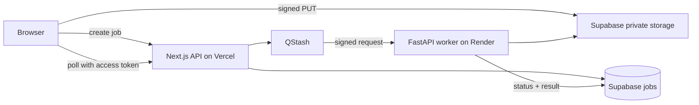

# cALorie

cALorie is a university project that estimates energy expenditure from a short
workout video. It uses pose landmarks to count repetitions, measures exercise
pace, selects an exercise-specific MET value, and shows a transparent calorie
estimate. It does **not** claim medical or wearable-grade accuracy.

## Status

V1 supports user-selected squats, jumping jacks and push-ups. The analysis
engine, validation, QStash verification, structured results and unit tests are
implemented. Evaluation videos must still be recorded with consent before real
accuracy figures can be reported.

## Architecture



The browser never receives the Supabase service-role key. Upload claims bind a
server-issued storage key to job creation. The worker accepts only verified
QStash requests and re-reads weight and exercise from the database.

## Analysis method

1. OpenCV reads FPS, frame count, duration and frames.
2. MediaPipe Pose extracts body landmarks and visibility values.
3. Exercise-specific state machines count complete cycles:
   - squat: standing → lowered → standing using knee angle;
   - jumping jack: closed → open → closed using wrists and ankle width;
   - push-up: extended → lowered → extended using elbow and body angles.
4. Repetitions per minute determine light, moderate or vigorous intensity.
5. A configured MET value is applied:

```text
Calories = MET × 3.5 × body_weight_kg / 200 × duration_minutes
```

The displayed range is ±15%, ±25% or ±35% for high, medium or low confidence.
Confidence comes from valid-pose-frame ratio and complete counted repetitions;
it is not random. A video with almost no valid pose frames fails instead of
returning an invented value.

## Result fields

- `exercise`: selected supported exercise.
- `duration_seconds`: FPS/frame-count duration.
- `repetitions`: complete state-machine cycles.
- `repetitions_per_minute`: count normalized by duration.
- `intensity`: tempo band used for MET selection.
- `met_value`: configured metabolic equivalent.
- `calories_estimated`, `calories_low`, `calories_high`: point estimate and
  quality-dependent range.
- `confidence`: pose/count quality category.
- `frames_analyzed`: decoded frames.
- `valid_pose_frame_ratio`: frames with the required visible landmarks.
- `warnings`: actionable camera or movement notes.

## Local setup

Requirements: Node.js 20+, Python 3.11, a Supabase project and QStash account.

Apply `supabase/schema.sql` in the Supabase SQL editor. Then configure the web:

```bash
cd web
cp .env.example .env.local
npm ci
npm run dev
```

Configure and run the worker in another terminal:

```bash
cd worker
cp .env.example .env
python3.11 -m venv .venv
source .venv/bin/activate
pip install -r requirements-dev.txt
set -a; source .env; set +a
uvicorn main:app --reload
```

QStash must call the public URL in `WORKER_PUBLIC_URL`; a local tunnel is needed
for a complete local queue test. Do not expose a development tunnel without
signature verification enabled.

## Environment variables

Web (server-side only):

- `SUPABASE_URL`
- `SUPABASE_SERVICE_ROLE_KEY`
- `QSTASH_TOKEN`
- `WORKER_URL`
- `UPLOAD_TOKEN_SECRET` — random string of at least 32 characters

Worker:

- `SUPABASE_URL`
- `SUPABASE_SERVICE_ROLE_KEY`
- `WORKER_PUBLIC_URL`
- `QSTASH_CURRENT_SIGNING_KEY`
- `QSTASH_NEXT_SIGNING_KEY`

Never prefix these values with `NEXT_PUBLIC_` and never commit real `.env`
files.

## Testing

```bash
cd worker && pytest -q
cd web && npm test
cd web && npm run lint && npm run build
```

Core tests cover joint angles, invalid inputs, MET calories, state transitions,
synthetic movement sequences, intensity and quality. API validation has its own
web tests.

## Evaluation

Record consented sample videos and update `evaluation/manifest.csv`. Run:

```bash
python evaluation/run_evaluation.py
```

The reproducible CSV compares manual and predicted counts, actual and detected
duration, pose coverage, calorie output and runtime. See `evaluation/README.md`.
Do not report evaluation accuracy until real sample rows have been produced.

## Deployment

- Vercel: import the repository, choose `web/` as root and add web variables.
- Render: use `render.yaml` and add worker secrets.
- Supabase: apply the schema and keep the `workout-videos` bucket private.
- QStash: use `WORKER_URL/process` and copy both signing keys to Render.

## Video guidance

- Keep exactly one person and all required joints in frame.
- Use a stable camera and even lighting.
- Squat: side or 45° view.
- Jumping jack: front, full-body view.
- Push-up: unobstructed side view.
- Accepted formats: MP4, MOV, WebM; maximum 100 MB and 3 minutes.

## Limitations and ethics

MET values describe population averages. Actual expenditure varies with age,
sex, technique, fitness, body composition and physiology. A monocular camera
can lose landmarks through occlusion, loose clothing, poor lighting or an
incorrect angle. The state-machine thresholds are explainable but must be
evaluated on a diverse, consented dataset. Videos can contain sensitive personal
data; use private storage and a retention/deletion policy in any public demo.

## Future work

- automatic exercise classification after a reliable labeled dataset exists;
- per-user threshold calibration and more exercises;
- durable queue workers instead of in-process background execution;
- scheduled cleanup of stored videos and stale jobs;
- authenticated history and stronger distributed rate limiting;
- browser upload progress with resumable uploads;
- evaluation charts and the final teacher presentation.
