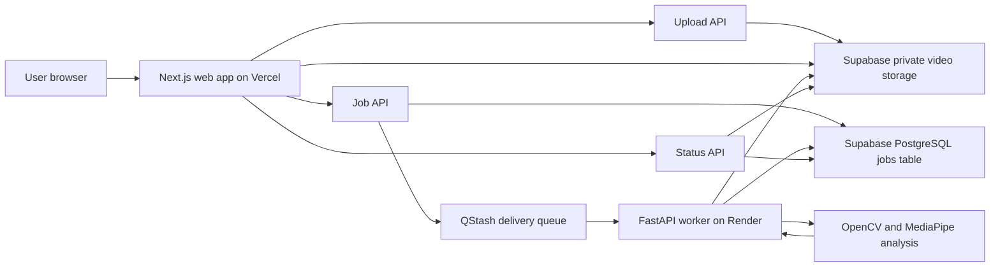
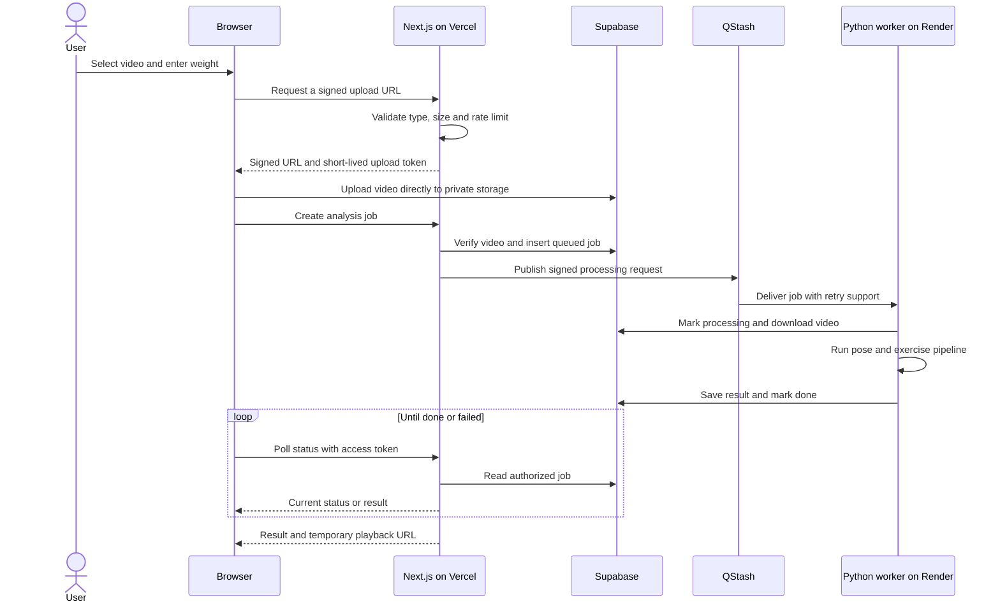
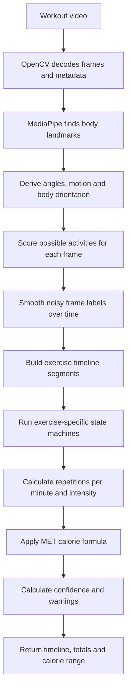
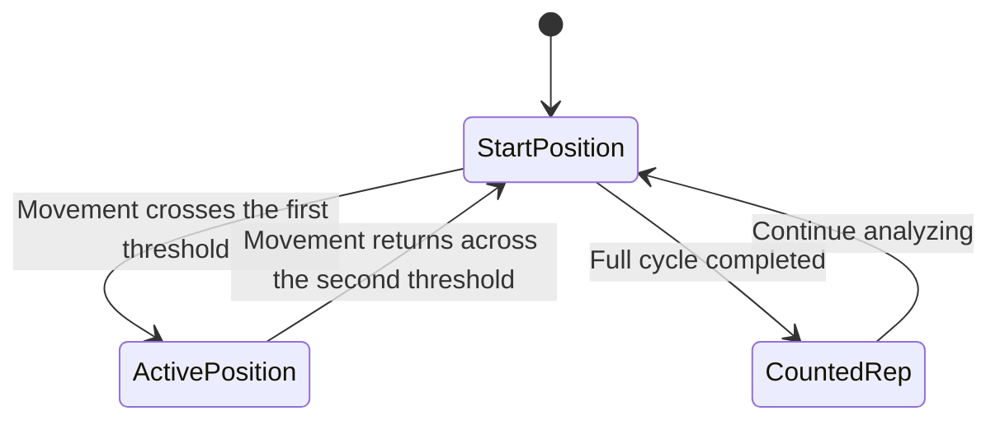
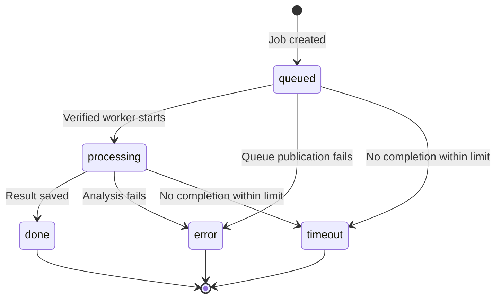

# How cALorie works

This document explains the entire cALorie system, from selecting a video in the
browser to displaying repetitions and estimated calories. It also explains the
main technical terms without assuming computer-vision experience.

## 1. What the program does

cALorie accepts a short workout video and the user's body weight. It follows a
single person's body pose over time, identifies supported bodyweight exercises,
counts complete repetitions, estimates effort from pace, and calculates a
calorie range.

It currently recognizes:

- squat;
- jumping jack;
- push-up;
- pull-up;
- lunge;
- sit-up;
- mountain climber;
- burpee (experimental);
- plank (duration rather than repetitions).

This is an explainable, pose-based estimator. It is not medical software, a
wearable replacement, or a promise of exact energy expenditure.

## 2. System architecture



There are five main parts:

| Part | Technology | Responsibility |
|---|---|---|
| Browser interface | React, Next.js, TypeScript, Tailwind CSS | Select the video, enter weight, show progress and results |
| Web server | Next.js API routes on Vercel | Validate requests, authorize uploads, create jobs and return results |
| Data layer | Supabase Storage and PostgreSQL | Store private videos and job/result records |
| Queue | Upstash QStash | Deliver a signed processing request and retry temporary failures |
| Analysis worker | Python, FastAPI, OpenCV, MediaPipe | Read the video, follow the pose, recognize movement, count repetitions and estimate calories |

The web app does not perform the heavy computer-vision work. Vercel handles the
short web requests, while the Render worker handles the longer video analysis.

## 3. Complete request flow



### Upload

1. The browser accepts MP4, MOV, or WebM files up to 100 MB.
2. The upload API generates a random storage path and a signed URL.
3. The browser uploads directly to Supabase. The large file therefore does not
   pass through the Vercel server.
4. A server-generated HMAC token binds the approved storage path to job
   creation and expires after 15 minutes.

### Queue and processing

1. The create-job API checks the storage path, weight, exercise choice, upload
   token, rate limit, and whether the video actually exists.
2. It creates a database row with status `queued`.
3. QStash calls the Render worker's `/process` endpoint. The worker verifies the
   QStash signature before accepting the request.
4. The worker re-reads authoritative inputs from the database, downloads the
   video to a temporary directory, and runs the analysis.
5. It stores either the structured result or a safe error message.

### Results

The browser polls a status endpoint with the job ID and a random access token.
When processing finishes, the API returns the result plus a one-hour signed URL
for private video playback. A job that remains unfinished for ten minutes is
reported as timed out.

## 4. Video-analysis pipeline

In this project, **pipeline** means an ordered chain of processing stages. The
output of one stage becomes the input of the next.



### Stage 1: decode the video

OpenCV reads the file and obtains frames per second, frame count, width, height,
and duration. It then supplies frames in time order. OpenCV does not recognize
the exercise here; it is the video-reading and image-processing layer.

### Stage 2: estimate the pose

MediaPipe Pose processes each frame and returns body landmarks such as
shoulders, elbows, wrists, hips, knees, and ankles. Each landmark has normalized
image coordinates and a visibility score. cALorie ignores a measurement when
the required points are not visible enough.

### Stage 3: derive features

Raw landmark coordinates are converted into measurements that are easier to
reason about:

- left and right knee angles;
- elbow angle;
- shoulder-hip-ankle body angle;
- shoulder-hip-knee hip angle;
- whether the torso is mostly horizontal;
- whether both wrists are above the shoulders;
- ankle distance divided by shoulder width;
- average movement between consecutive frames;
- knee and elbow angular velocity;
- difference between the two knee angles.

Ratios and angles are used because they are less dependent on distance from the
camera than raw pixel measurements.

### Stage 4: classify every frame

The program assigns scores to possible activities using transparent rules. For
example, a straight horizontal body suggests a plank; a horizontal moving body
with elbow motion suggests a push-up; raised wrists and wide ankles suggest a
jumping jack. If no score is strong enough, the label is `unknown`.

This is a **heuristic classifier**, not a separately trained neural-network
exercise classifier. MediaPipe itself is machine-learning based, but the rules
after MediaPipe are code that can be read and adjusted.

### Stage 5: smooth and segment time

Single-frame predictions can flicker. A short majority-vote window smooths the
labels, brief missing-pose periods are tolerated, very short segments are
removed, and nearby segments of the same exercise can be joined. The result is
a timeline such as `idle → squat → jumping jack → unknown`.

### Stage 6: count complete repetitions

Each exercise uses a small **state machine**. A state machine remembers which
phase of the movement was last reached and only adds a repetition after a full
cycle. This reduces double counting from noisy frames.



The exact states differ by exercise; the diagram shows the shared principle.

### Stage 7: estimate intensity and calories

For repetition exercises, repetitions per minute are mapped to light, moderate,
or vigorous effort. Each exercise and intensity has a configured MET value.
Calories are calculated with:

```text
Calories = MET × 3.5 × body weight in kg ÷ 200 × duration in minutes
```

The program also returns a range. The range widens when pose coverage or the
count quality is weaker. This range communicates uncertainty; it is not a
medical confidence interval.

## 5. Exercise recognition rules

| Exercise | Main evidence | Repetition logic | Best camera view |
|---|---|---|---|
| Squat | Knee flexion while torso is upright | standing → lowered → standing | Side or 45 degrees |
| Jumping jack | Wrists rise and ankles spread relative to shoulders | closed → open → closed | Front, full body |
| Push-up | Horizontal body, elbow flexion and extension | arms extended → lowered → extended | Side |
| Pull-up | Wrists overhead and changing elbow angle | hanging/extended → pulled/flexed → extended | Front or slight angle |
| Lunge | Large difference between left and right knee angles | extended → lowered split stance → extended | Side or 45 degrees |
| Sit-up | Horizontal orientation and changing hip angle | reclined → upright/flexed → reclined | Side |
| Mountain climber | Horizontal torso and alternating knee asymmetry | one knee driven → opposite knee driven | Side or 45 degrees |
| Burpee | Fast large motion with deep knee phase and horizontal phase | standing → lowered/floor phase → standing | Side, full body |
| Plank | Straight, mostly horizontal body with little motion | Duration only | Side |

These are geometric approximations, not full biomechanical judgments. Burpees
are particularly variable, so their current detection is marked experimental.

## 6. What OpenCV, MediaPipe and the other terms mean

### Computer vision

Software techniques that extract useful information from images or video. In
cALorie the useful information is body movement over time.

### OpenCV

An open-source computer-vision library. cALorie uses it to open the video,
inspect metadata, and read individual frames. OpenCV is the video plumbing; it
does not, by itself, decide that a frame contains a squat.

### MediaPipe Pose

Google's pose-estimation system. It uses a trained model to locate body points
in an image. cALorie uses those points as its input instead of attempting to
understand raw pixels directly.

### Landmark or keypoint

A predicted body location such as the left knee or right wrist. A sequence of
landmarks forms a lightweight representation of the person's pose.

### Normalized coordinate

A position expressed relative to image size, normally between zero and one.
This allows the same code to work with different video resolutions.

### Visibility

MediaPipe's estimate of whether a landmark is actually visible. Low-visibility
points may be behind another body part, outside the frame, or unclear.

### Joint angle

The angle formed by three points. The hip-knee-ankle angle, for example,
describes how straight or bent a knee is.

### Feature

A measurement derived from input data and used for a decision. Knee angle,
motion speed, and ankle-to-shoulder ratio are cALorie features.

### Heuristic

An understandable rule that works as an approximation, such as “a sufficiently
bent knee plus an upright torso may indicate a squat.” Heuristics are easy to
debug but need validation across different people and camera views.

### Classifier

A component that chooses a category. cALorie's frame classifier chooses among
the supported exercises, idle, and unknown using feature scores.

### State machine

Logic that remembers the current movement phase. It prevents a held position or
small jitter from being counted as many repetitions.

### FPS

Frames per second: how many still images make up one second of video. FPS is
used to convert frame positions into timestamps and velocities.

### Temporal smoothing

Using nearby moments to stabilize a prediction. Human movement is continuous,
so one unusual frame should not normally change the exercise label.

### Segmentation

Dividing a whole video into time ranges with labels. This is how one upload can
contain squats, push-ups, planks, rest, and other movements in sequence.

### Confidence

A quality label based on valid-pose coverage and completed repetitions. It
describes how much usable evidence the pipeline had; it is not certainty that
every label is correct.

### MET

Metabolic Equivalent of Task. One MET is approximately resting energy use.
Exercise MET values are population-level estimates used with weight and time to
estimate calories.

### API

An interface through which software components exchange structured requests and
responses. The browser talks to Next.js API routes, and QStash calls the worker
API.

### Next.js, React, TypeScript and Tailwind CSS

Next.js is the web framework; React builds interactive interface components;
TypeScript adds checked types to JavaScript; Tailwind CSS supplies styling
utilities. Together they implement the site and its server-side API routes.

### FastAPI

A Python framework for web APIs. It exposes the worker's health and processing
endpoints and validates incoming request shapes.

### QStash

A managed message-delivery service. It separates the quick “create job” request
from long-running analysis, signs calls to the worker, and retries temporary
failures.

### Webhook and signature

A webhook is an HTTP request sent automatically from one service to another. A
cryptographic signature lets the worker verify that a QStash request is genuine
and was not modified.

### Supabase, PostgreSQL and private storage

Supabase provides the PostgreSQL database and object storage. PostgreSQL holds
job metadata and results. The private bucket holds video objects that are not
publicly accessible.

### Signed URL

A temporary URL carrying cryptographic permission for one storage operation.
It allows direct upload or playback without exposing the powerful Supabase
service-role key.

### Vercel and Render

Vercel hosts the Next.js web application and short API requests. Render hosts
the Python worker, which needs a runtime suitable for OpenCV, MediaPipe, and
longer processing.

### Environment variable

A deployment setting supplied outside source code, commonly used for service
URLs and secrets. Real secret values must never be committed to GitHub.

### Pipeline

Any ordered processing chain. Here it usually means video decode → pose →
features → labels → segments → counts → calories → result.

## 7. YOLO, RetinaNet, and what cALorie actually uses

cALorie does **not** currently use YOLO or RetinaNet.

- YOLO is mainly an object-detection family: it draws boxes around objects and
  assigns object categories.
- RetinaNet is also an object detector, known for focal loss that addresses
  foreground/background class imbalance.
- MediaPipe Pose is a pose estimator: it returns articulated body landmarks,
  which are more useful than a single person bounding box for measuring joint
  motion.

The actual stack is:

```text
OpenCV video frames
    → MediaPipe Pose landmarks
    → custom geometric features
    → custom heuristic activity scores
    → temporal smoothing and segmentation
    → custom per-exercise state machines
    → MET calorie calculation
```

A future learned sequence model could replace or assist the heuristic activity
classifier, but only after collecting or adopting a suitable labeled dataset
and reporting evaluation results honestly.

## 8. Data and job states



A job record contains identifiers, storage location, selected exercise or auto
mode, weight, status, timestamps, access token, structured result, and a safe
error field. The result contains timeline segments, per-exercise totals,
duration, calorie estimate and range, valid-pose ratio, confidence, and warnings.

## 9. Security and privacy design

- Videos are stored in a private bucket.
- Browser uploads and playback use short-lived signed URLs.
- The Supabase service-role key stays on trusted servers.
- An HMAC token prevents a user from creating a job for an arbitrary object.
- A random job access token protects status and result lookup.
- QStash signatures protect the worker endpoint.
- Storage paths and request values are validated again on the server.
- Rate limiting reduces automated abuse.
- Temporary worker files are isolated and removed with their temporary folder.
- User-facing errors avoid returning internal secrets or stack traces.

Videos can still contain sensitive biometric and environmental information. A
public deployment needs a clear consent, retention, and deletion policy.

## 10. Deployment and configuration

| Service | Deployed component | Required configuration |
|---|---|---|
| Vercel | `web/` Next.js project | Supabase URL/key, QStash token, worker URL, upload-token secret |
| Render | `worker/` FastAPI service | Supabase URL/key, public worker URL, current and next QStash signing keys |
| Supabase | Private bucket and jobs table | Apply the SQL schema and migrations |
| QStash | Delivery to the worker | Publish to the worker `/process` URL |

The committed `.env.example` files show variable names only. Actual values live
in local or hosting-provider secret settings.

## 11. Accuracy, limitations, and honest interpretation

Current limitations include:

- one person is expected in the frame;
- thresholds can behave differently across bodies, techniques, clothing,
  camera angles, and mobility ranges;
- occlusion, low light, motion blur, and cropped joints reduce pose quality;
- monocular video has no true depth measurement;
- similar poses can confuse a frame-level rule system;
- transitions between exercises can temporarily become `unknown`;
- burpees have many valid styles and are harder to represent with one rule;
- calorie estimates inherit uncertainty from MET population averages;
- the system has not yet earned a real accuracy percentage on a diverse,
  consented evaluation set.

The correct next step is not to invent an accuracy number. It is to record or
obtain representative labeled videos, compare predicted segments and counts to
human annotations, and report metrics such as count mean absolute error,
segment precision/recall, pose coverage, runtime, and failure rate.

## 12. Sensible future upgrades

1. Build a versioned, consented evaluation dataset covering different people,
   viewpoints, lighting, tempos, and technique variations.
2. Calibrate thresholds from evidence rather than isolated examples.
3. Add more exercises only with explicit features, counters, tests, and sample
   videos.
4. Train a temporal model such as an LSTM, TCN, or Transformer if the labeled
   dataset becomes large enough; compare it against the explainable baseline.
5. Use per-user calibration and camera-view detection to reduce threshold bias.
6. Add multi-person rejection, better occlusion handling, and pose tracking.
7. Add automatic storage cleanup and a user-facing deletion control.
8. Publish an evaluation report and model/version metadata with every result.

## 13. Code map

| Area | Important path | Purpose |
|---|---|---|
| Upload authorization | `web/app/api/upload-url/route.ts` | Validate file and issue signed upload permission |
| Job creation | `web/app/api/create-job/route.ts` | Validate claim, create row and queue work |
| Status/result | `web/app/api/job-status/[id]/route.ts` | Authorize polling and return result/playback URL |
| Worker API | `worker/main.py` | Verify queue call and manage processing status |
| Main analysis | `worker/analysis/pipeline.py` | Orchestrate every vision and calculation stage |
| Pose extraction | `worker/analysis/pose.py` | Run MediaPipe and return named landmarks |
| Features | `worker/analysis/features.py` | Convert landmarks into geometric measurements |
| Classification | `worker/analysis/classifier.py` | Score frame activities |
| Timeline | `worker/analysis/segmentation.py` | Smooth labels and create segments |
| Counters | `worker/analysis/exercises/` | Count complete movement cycles |
| Calories | `worker/analysis/met.py`, `calories.py`, `intensity.py` | Select effort and calculate estimate/range |
| Database | `supabase/schema.sql`, `supabase/migrations/` | Define storage policies and job schema |
| Evaluation | `evaluation/` | Compare predictions with annotated samples |

## 14. Further reading

- [OpenCV documentation](https://docs.opencv.org/)
- [MediaPipe Pose Landmarker documentation](https://ai.google.dev/edge/mediapipe/solutions/vision/pose_landmarker)
- [Next.js documentation](https://nextjs.org/docs)
- [FastAPI documentation](https://fastapi.tiangolo.com/)
- [Supabase documentation](https://supabase.com/docs)
- [QStash documentation](https://upstash.com/docs/qstash)
- [Vercel documentation](https://vercel.com/docs)
- [Render documentation](https://render.com/docs)

These links explain the underlying tools. cALorie's specific exercise rules and
pipeline are implemented in this repository, not copied from a single external
model.
